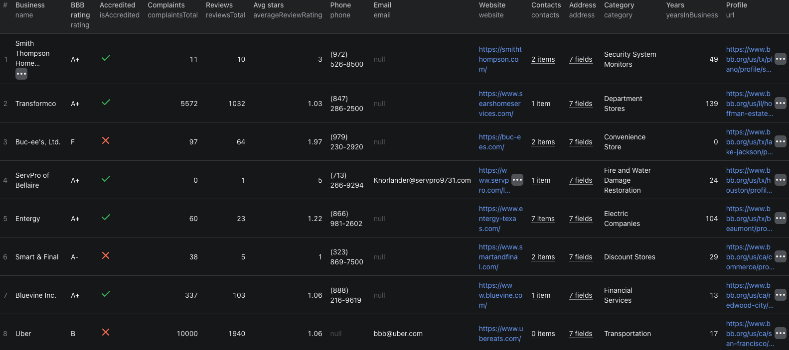

# How to Scrape BBB Business Details in Node.js

This example shows how to collect BBB company contacts, accreditation details, complaint history, and customer reviews in Node.js using [BBB Business Details Scraper](https://apify.com/piotrv1001/bbb-business-details-scraper) on Apify. It calls an existing Actor rather than implementing a BBB scraper.



## What this example does

- Calls `piotrv1001/bbb-business-details-scraper`
- Passes one BBB profile URL and small complaint and review limits
- Waits for the Actor run to finish
- Fetches the resulting business record from the dataset
- Prints each structured result

## Prerequisites

- [Node.js](https://nodejs.org) 18 or newer
- An [Apify account](https://console.apify.com/sign-up)
- An Apify API token from **Settings → Integrations**

## Installation

```bash
npm install
```

## Environment setup

```bash
cp .env.example .env
```

Add your token to `.env`:

```env
APIFY_TOKEN=your_apify_token_here
```

## Usage

```bash
npm start
```

## Code example

```js
import { ApifyClient } from 'apify-client';
import 'dotenv/config';

// Initialize the ApifyClient with your Apify API token
// Set APIFY_TOKEN in your .env file (copy .env.example to get started)
const client = new ApifyClient({
    token: process.env.APIFY_TOKEN,
});

// Prepare Actor input
const input = {
    startUrls: [
        {
            url: 'https://www.bbb.org/us/tx/plano/profile/security-system-monitors/smith-thompson-home-security-0875-9237',
        },
    ],
    includeComplaints: true,
    includeReviews: true,
    maxItems: 1,
    maxComplaintsPerBusiness: 3,
    maxReviewsPerBusiness: 3,
    proxyConfiguration: {
        useApifyProxy: true,
        apifyProxyGroups: ['RESIDENTIAL'],
        apifyProxyCountry: 'US',
    },
};

// Run the Actor and wait for it to finish
const run = await client.actor('piotrv1001/bbb-business-details-scraper').call(input);

// Fetch and print Actor results from the run's dataset (if any)
console.log('Results from dataset');
console.log(`💾 Check your data here: https://console.apify.com/storage/datasets/${run.defaultDatasetId}`);
const { items } = await client.dataset(run.defaultDatasetId).listItems();
items.forEach((item) => {
    console.dir(item);
});

// 📚 Want to learn more 📖? Go to → https://docs.apify.com/api/client/js/docs
```

## Example output

[`sample-output.json`](./sample-output.json) contains a fictional, abbreviated record that matches the Actor's output shape. Key fields include company identity, address, published contact channels, profile-listed management, BBB rating and accreditation, business history, complaint and review totals, and optional nested complaint and review objects.

## Use cases

- Qualify businesses before sales outreach
- Review vendors and suppliers
- Organize accreditation and license checks
- Monitor complaint and customer-review trends
- Enrich an existing list of BBB profile URLs

## Try the Actor on Apify

**[Open BBB Business Details Scraper on Apify](https://apify.com/piotrv1001/bbb-business-details-scraper)**

## Related resources

- [How to Scrape BBB Business Details, Complaints, and Reviews](https://www.falconscrape.com/blog/how-to-scrape-bbb-business-details)
- [Apify JavaScript client documentation](https://docs.apify.com/api/client/js/docs)

## License

MIT
